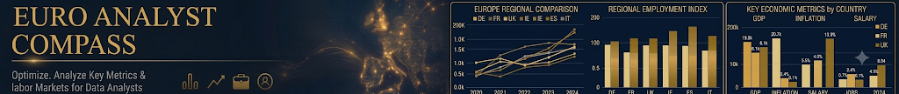

<p align="center">
  
</p>

<p align="center">
  <a href="https://bakidiskostas.github.io/euro-analyst/"></a>
  <a href="../../actions/workflows/update-data.yml"></a>
  
</p>

# Euro Analyst Compass

**[→ Open the live dashboard](https://bakidiskostas.github.io/euro-analyst/)**

Deciding which European country to move to shouldn't come down to gut feeling and a few forum threads. This dashboard puts 30 countries side by side on the things that actually decide whether a move works out — what you'd earn, what it costs to live there, how many data jobs exist, how good the healthcare is — and turns all of it into one comparable score per country.

Built for my own job search as a data analyst. The methodology is honest about its limits, and every number traces back to an official source.

---

## What it does

**Compare any indicator across any countries, over time.**
Pick an indicator, pick the countries you care about (one, five, or all 30), choose a 3, 5 or 10-year window. The chart redraws instantly. No server — it's a single JSON file and some JavaScript.

**Rank every country on one score.**
Each of the 16 indicators is ranked across all countries and mapped to 0–100. Indicators where lower is better (inflation, unemployment, price levels, tax) get inverted, so 100 always means "good for you". The overall score is a weighted average — salary and job density count more than English proficiency, because that's what matters when you're actually moving.

**Drill into a single country.**
Click any row and you get its full scorecard: every indicator with its value, its rank (#4 of 30), its 0–100 score, and a position strip showing where it sits between worst and best. Plus a 10-year trend chart.

**See the real job market, not vibes.**
Live counts of data analyst / engineer / scientist ads, normalised per 100k population — because 40,000 ads in Germany and 240 in Greece mean very different things relative to market size. Plus average advertised salary and the share of ads that are remote.

## The 16 indicators

| | Indicator | Source | Direction |
|---|---|---|---|
| **Economy** | GDP growth | Eurostat | Higher better |
| | Inflation (HICP) | Eurostat | Lower better |
| | Unemployment rate | Eurostat | Lower better |
| | Real household income growth | Eurostat | Higher better |
| **Money** | Net annual salary (avg wage, single) | Eurostat | Higher better |
| | Tax & contributions wedge | Derived (gross vs net) | Lower better |
| **Cost of living** | Price level, household consumption | Eurostat PPP | Lower better |
| | Food price level | Eurostat PPP | Lower better |
| | Energy & housing price level | Eurostat PPP | Lower better |
| **Life** | Life expectancy *(health system proxy)* | Eurostat | Higher better |
| | Life satisfaction (0–10) | Eurostat | Higher better |
| | English proficiency | EF EPI | Higher better |
| **Job market** | Data job ads | Adzuna / Jooble | Higher better |
| | Data job ads per 100k population | Derived | Higher better |
| | Average advertised salary | Adzuna | Higher better |
| | Share of remote ads | Adzuna / Jooble | Higher better |

Coverage: all 27 EU member states plus Norway, Switzerland and Iceland.

## Data sources

Everything comes from official, free APIs. Nothing is scraped.

| Source | What it provides | Access |
|---|---|---|
| **[Eurostat](https://ec.europa.eu/eurostat/web/main/data/web-services)** | 11 macro indicators + population | Open API, no key, CC BY 4.0 |
| **[Adzuna](https://developer.adzuna.com)** | Job ads, salaries, remote share — AT, BE, CH, DE, ES, FR, IT, NL, PL | Free API key |
| **[Jooble](https://jooble.org/api/about)** | Job ads, remote share — the other 21 countries, **incl. Greece and Cyprus** | Free API key |
| **[EF EPI](https://www.ef.com/epi/)** | English proficiency scores | Published rankings, updated annually in code |

**Not used, deliberately:** Indeed (ToS prohibit scraping, no public API), EURES (API restricted to approved partners).

## How the scoring works

For each indicator, countries with data are ranked, then mapped linearly onto 0–100:

```
score = 100 × (n − 1 − rank) / (n − 1)
```

For "lower is better" indicators the ranking is reversed first, so the country with the lowest inflation scores 100. The country total is the weighted mean of its indicator scores, with weights defined in `INDICATORS` in `fetch_data.py` — change them and the ranking shifts to match your priorities.

**Known limitations, stated up front:**
- Rank-based scoring shows *order*, not *distance*. #1 and #2 might be nearly identical or worlds apart — the score won't tell you which.
- Advertised salaries are gross and skew high: senior and international roles sit in the same pool as entry-level ones.
- Job ad counts are keyword matches, so they include false positives and miss ads that don't use the exact titles.
- Countries without job data are scored on their remaining 12 indicators, which slightly flatters them by omission.
- EF EPI measures self-selected online test takers, not the general population.

## Setup

```
1. Fork or upload this repo (keep the .github/workflows/ folder)
2. Settings → Pages → Deploy from a branch → main / root
3. Settings → Secrets and variables → Actions → add:
     ADZUNA_APP_ID · ADZUNA_APP_KEY · JOOBLE_API_KEY
4. Actions tab → "Update data daily" → Run workflow
```

That last step loads real data and clears the demo banner. After that it runs itself on the 1st of every month.

## Run it locally

```bash
python fetch_data.py --sample   # realistic demo data, no internet or keys needed
python -m http.server           # → http://localhost:8000
```

Standard library only — no pip install, no build step, no dependencies.

## Project structure

```
fetch_data.py                    # fetches, scores, writes data/data.json
data/data.json                   # the entire dataset (~75 KB)
index.html                       # comparison chart + ranking table
country.html                     # per-country scorecard (?c=DE)
assets/banner.svg                # map: Natural Earth data, EPSG:3035 projection
.github/workflows/update-data.yml
```

The fetcher degrades gracefully: if a Eurostat dataset changes its dimension codes (which happens), it retries without the optional filters, and failing that keeps the previous values rather than shipping an empty chart.

## License

Code MIT. Data belongs to its sources — Eurostat under CC BY 4.0, job data per Adzuna and Jooble API terms.
